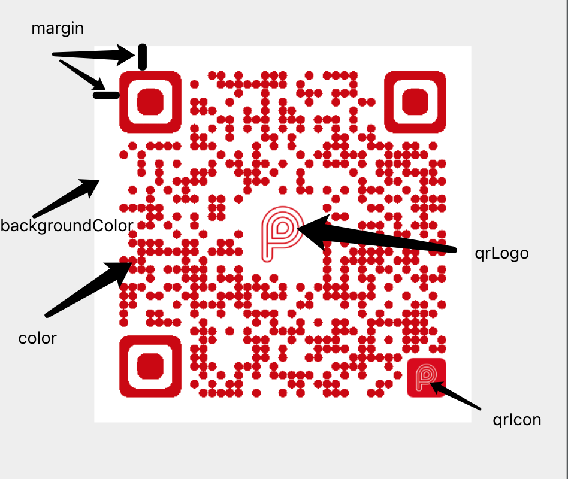

# PayMeQrCode

A android library for payme style qrcode

### snapshot


### integrate

Step 1. Add the JitPack repository to your build file
```gradle
allprojects {
    repositories {
        ...
        maven { url "https://jitpack.io" }
    }
}
```

Step 2. Add the dependency

```gradle
dependencies {
    implementation 'com.github.phonechan:PayMeQrCode:v1.0'
}
```

Step 3. Add the PayCode widget to your layout xml file 

```xml
<?xml version="1.0" encoding="utf-8"?>
<RelativeLayout xmlns:android="http://schemas.android.com/apk/res/android"
    xmlns:app="http://schemas.android.com/apk/res-auto"
    xmlns:tools="http://schemas.android.com/tools"
    android:id="@+id/container"
    android:layout_width="match_parent"
    android:layout_height="match_parent"
    tools:context=".MainActivity">

    <qrcode.PayCode
        android:id="@+id/pay_code"
        android:layout_width="240dp"
        android:layout_height="240dp"
        android:layout_centerInParent="true"
        app:backgroundColor="@android:color/white"
        app:color="@android:color/holo_red_dark"
        app:margin="16dp"
        app:qrIcon="@drawable/icon_payme"
        app:qrLogo="@drawable/logo_payme" />

</RelativeLayout>
```

Step 4. use the PayCode in your Activity

```java
public class MainActivity extends AppCompatActivity {

    private static final String TAG = MainActivity.class.getSimpleName();

    private static final String text = "https://qr.payme.hsbc.com.hk/2/ThisIsAnExamplePayCode";

    private PayCode payCode;

    @Override
    protected void onCreate(Bundle savedInstanceState) {
        super.onCreate(savedInstanceState);
        setContentView(R.layout.activity_main);

        payCode = findViewById(R.id.pay_code);
        payCode.drawQrCode(text, R.drawable.logo_payme);
    }
}
```

### reference


* XML attributes

attribute|meaning
---|---
backgroundColor|The background color of QR code
color|The front color of QR code
margin|Distance to the border of QR code
qrIcon|The center image of QR code
qrLogo|The bottom right image of QR code
text|The content of QR code



* Public methods

```java
/**
 * generate QR code of text string
 * @param text the content
 * @param resId the image resource id
 */
void drawQrCode(String text, int resId)

/**
* generate QR code of text string
* @param text the content
* @param bitmap the bitmap
*/
void drawQrCode(String text, Bitmap bitmap)
```


